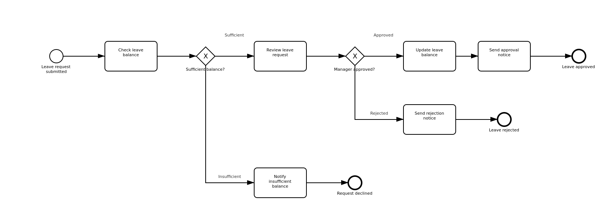
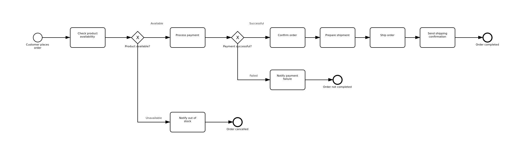
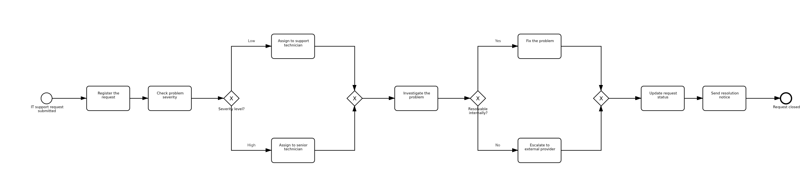

# BPMN Process Modelling — Exercise 1

**Author:** Shoham

Three business processes modelled in **BPMN 2.0** using the basic building blocks:
start events, tasks, exclusive gateways, sequence flows and end events.

All three models are built for **Camunda 8**, are syntactically valid against the
BPMN 2.0 schema, and deploy to a Camunda 8 engine without validation errors.

| # | Scenario | Model | Diagram |
|---|---|---|---|
| Q1 | Employee Leave Approval | [`Q1_emp_leave_approval.bpmn`](Q1_emp_leave_approval.bpmn) | [view](Q1_emp_leave_approval.png) |
| Q2 | Online Purchase Order Processing | [`Q2_purchase_order.bpmn`](Q2_purchase_order.bpmn) | [view](Q2_purchase_order.png) |
| Q3 | IT Service Request Handling | [`Q3_it_service_request.bpmn`](Q3_it_service_request.bpmn) | [view](Q3_it_service_request.png) |

---

## Repository structure

```
.
├── README.md                        This document — scenario explanations
├── Q1_emp_leave_approval.bpmn       Scenario Q1 model
├── Q1_emp_leave_approval.png        Scenario Q1 diagram
├── Q2_purchase_order.bpmn           Scenario Q2 model
├── Q2_purchase_order.png            Scenario Q2 diagram
├── Q3_it_service_request.bpmn       Scenario Q3 model
└── Q3_it_service_request.png        Scenario Q3 diagram
```

---

## Notation used

| Symbol | Element | Meaning in these models |
|---|---|---|
| Thin circle | **Start Event** | The trigger that creates one process instance |
| Rounded rectangle | **Task** | One unit of work performed by a person or a system |
| Diamond marked ✕ | **Exclusive Gateway** | A decision — exactly one outgoing path is taken |
| Arrow | **Sequence Flow** | The order in which elements are executed |
| Thick circle | **End Event** | A terminal state of the process |

An exclusive gateway is used at every decision point in these models because in
each case the alternatives are genuinely mutually exclusive. A parallel gateway
would be wrong: it would activate *all* outgoing paths simultaneously, which would
mean — for example — simultaneously approving and rejecting the same leave request.

---

# Scenario 1 — Employee Leave Approval



**Process ID:** `employee-leave-approval`

## The scenario

An employee applies for leave through the company's HR system. The system must
confirm the employee has sufficient leave available, route the request to a
manager for a human decision, and notify the employee of the outcome — whichever
outcome occurs.

## How the process works

The **start event** *Leave request submitted* creates the instance when the
employee files the request.

**Check leave balance** retrieves the employee's remaining entitlement from HR
records. The first **exclusive gateway**, *Sufficient balance?*, then routes on
the result:

- **Sufficient** → the request proceeds to **Review leave request**, a *user
  task*. This is modelled as a user task rather than a system task because a
  human being makes the judgement and the process must wait for them.
- **Insufficient** → the process bypasses approval entirely, goes to **Notify
  insufficient balance**, and terminates at *Request declined*.

After the manager acts, the second **exclusive gateway** *Manager approved?*
splits again:

- **Approved** → **Update leave balance**, then **Send approval notice**,
  terminating at *Leave approved*.
- **Rejected** → **Send rejection notice**, terminating at *Leave rejected*.

## Process paths

The model contains three distinct routes from start to end. Every possible
execution of this process follows exactly one of them.

**Path 1 — Insufficient balance** (declined without human involvement)

```
Leave request submitted
        ↓
Check leave balance
        ↓
Sufficient balance?  ── Insufficient ──┐
                                       ↓
                          Notify insufficient balance
                                       ↓
                                Request declined
```

**Path 2 — Approved**

```
Leave request submitted
        ↓
Check leave balance
        ↓
Sufficient balance?  ── Sufficient ──→ Review leave request
                                                ↓
                                       Manager approved?  ── Approved ──┐
                                                                        ↓
                                                          Update leave balance
                                                                        ↓
                                                          Send approval notice
                                                                        ↓
                                                              Leave approved
```

**Path 3 — Rejected by manager**

```
Leave request submitted
        ↓
Check leave balance
        ↓
Sufficient balance?  ── Sufficient ──→ Review leave request
                                                ↓
                                       Manager approved?  ── Rejected ──┐
                                                                        ↓
                                                          Send rejection notice
                                                                        ↓
                                                              Leave rejected
```

## Requirement traceability

| # | Requirement from the brief | Implemented as |
|---|---|---|
| 1 | Process starts when the employee submits a leave request | Start event `StartEvent_LeaveRequested` |
| 2 | HR system checks the leave balance | Task `Check leave balance` |
| 3 | If balance is sufficient, send to manager for approval | Gateway `Sufficient balance?` → user task `Review leave request` |
| 4 | If approved, update balance and send approval notification | Tasks `Update leave balance` → `Send approval notice` |
| 5 | If rejected, send rejection notification | Task `Send rejection notice` |
| 6 | If insufficient balance, send insufficient-balance notification | Task `Notify insufficient balance` |
| 7 | Process ends after the appropriate notification | Three end events, one per outcome |

## Design decisions

**Three end events rather than one.** Approved, rejected, and declined-for-balance
are three genuinely different business outcomes. Distinct end events make the
process measurable — the organisation can report how many requests fail at the
balance check versus how many managers actually decline, which a single shared end
event would hide.

**The balance check precedes the manager.** Placing the cheap automated check
before the expensive human step means a manager is never asked to consider a
request that could not be granted regardless of their decision.

**Balance update precedes notification.** The employee is never told leave is
approved before the deduction has been recorded.

---

# Scenario 2 — Online Purchase Order Processing



**Process ID:** `online-purchase-order`

## The scenario

A customer places an order online. The retailer confirms the product is in stock,
takes payment, and fulfils and ships the order — keeping the customer informed at
every point where the order cannot proceed.

## How the process works

The **start event** *Customer places order* triggers the instance.

**Check product availability** queries inventory. The **exclusive gateway**
*Product available?* routes on the result:

- **Unavailable** → **Notify out of stock** → *Order cancelled*. The process stops
  before any payment is attempted.
- **Available** → the flow continues to payment.

**Process payment** attempts the charge, and the **exclusive gateway** *Payment
successful?* handles the second decision:

- **Failed** → **Notify payment failure** → *Order not completed*.
- **Successful** → the fulfilment sequence begins.

The successful path then runs as four sequential tasks — **Confirm order** →
**Prepare shipment** → **Ship order** → **Send shipping confirmation** —
terminating at *Order completed*.

## Process paths

Three distinct routes exist. Two terminate early on failure; one completes the
sale.

**Path 1 — Product unavailable** (no payment attempted)

```
Customer places order
        ↓
Check product availability
        ↓
Product available?  ── Unavailable ──┐
                                     ↓
                          Notify out of stock
                                     ↓
                             Order cancelled
```

**Path 2 — Payment failed**

```
Customer places order
        ↓
Check product availability
        ↓
Product available?  ── Available ──→ Process payment
                                            ↓
                                  Payment successful?  ── Failed ──┐
                                                                   ↓
                                                    Notify payment failure
                                                                   ↓
                                                       Order not completed
```

**Path 3 — Successful order**

```
Customer places order
        ↓
Check product availability
        ↓
Product available?  ── Available ──→ Process payment
                                            ↓
                                  Payment successful?  ── Successful ──┐
                                                                       ↓
                                                              Confirm order
                                                                       ↓
                                                           Prepare shipment
                                                                       ↓
                                                                 Ship order
                                                                       ↓
                                                   Send shipping confirmation
                                                                       ↓
                                                            Order completed
```

## Requirement traceability

| # | Requirement from the brief | Implemented as |
|---|---|---|
| 1 | Process starts when a customer places an order | Start event `StartEvent_OrderPlaced` |
| 2 | System checks product availability | Task `Check product availability` |
| 3 | If unavailable, notify out of stock and end | Task `Notify out of stock` → end event `Order cancelled` |
| 4 | If available, process the payment | Gateway `Product available?` → task `Process payment` |
| 5 | If payment succeeds, confirm order and prepare shipment | Tasks `Confirm order` → `Prepare shipment` |
| 6 | If payment fails, notify customer and end | Task `Notify payment failure` → end event `Order not completed` |
| 7 | After preparation, ship the order | Task `Ship order` |
| 8 | Customer receives shipping confirmation | Task `Send shipping confirmation` |
| 9 | Process ends | End event `Order completed` |

## Design decisions

**Availability is checked before payment.** This is the most consequential
ordering decision in the model. Reversing it would mean charging customers for
stock the business cannot supply, creating a refund obligation on every
out-of-stock order. The sequence encodes a commercial rule, not merely a
convenience.

**Four fulfilment tasks rather than one.** Confirmation, picking, dispatch and
notification are performed by different actors and systems — order management, the
warehouse, the carrier, the notification service. Modelling them separately makes
each independently observable when monitoring live instances, so a stalled order
can be located precisely.

**Failure branches exit immediately.** Neither failure path loops or waits. A
failed order should leave the process cleanly; retry logic, if the business wanted
it, would be a deliberate later addition rather than an implicit one.

---

# Scenario 3 — IT Service Request Handling



**Process ID:** `it-service-request`

## The scenario

An employee reports an IT problem. The help desk registers it, triages it by
severity, routes it to an appropriately skilled technician, and either resolves it
internally or escalates it to an external provider — then closes the loop with the
employee.

## How the process works

The **start event** *IT support request submitted* begins the instance, and
**Register the request** creates the ticket record.

**Check problem severity** is a user task in which a help desk agent assesses
business impact. The **exclusive gateway** *Severity level?* then performs triage:

- **Low** → **Assign to support technician**
- **High** → **Assign to senior technician**

Both branches reconverge at an **exclusive merge gateway**, after which
**Investigate the problem** is performed by whichever technician was assigned.

The **exclusive gateway** *Resolvable internally?* creates the second split:

- **Yes** → **Fix the problem**
- **No** → **Escalate to external provider**

These paths merge at a second **exclusive gateway**, after which the process closes
identically regardless of route: **Update request status** → **Send resolution
notice** → *Request closed*.

## Process paths

Two independent binary decisions produce **four** distinct routes. All four
converge on the same closing sequence, which is precisely what the merge gateways
achieve — the closing steps are modelled once rather than four times.

**Path 1 — Low severity, resolved internally**

```
IT support request submitted → Register the request → Check problem severity
        ↓
Severity level?  ── Low ──→ Assign to support technician
        ↓
Investigate the problem
        ↓
Resolvable internally?  ── Yes ──→ Fix the problem
        ↓
Update request status → Send resolution notice → Request closed
```

**Path 2 — High severity, resolved internally**

```
IT support request submitted → Register the request → Check problem severity
        ↓
Severity level?  ── High ──→ Assign to senior technician
        ↓
Investigate the problem
        ↓
Resolvable internally?  ── Yes ──→ Fix the problem
        ↓
Update request status → Send resolution notice → Request closed
```

**Path 3 — Low severity, escalated externally**

```
IT support request submitted → Register the request → Check problem severity
        ↓
Severity level?  ── Low ──→ Assign to support technician
        ↓
Investigate the problem
        ↓
Resolvable internally?  ── No ──→ Escalate to external provider
        ↓
Update request status → Send resolution notice → Request closed
```

**Path 4 — High severity, escalated externally**

```
IT support request submitted → Register the request → Check problem severity
        ↓
Severity level?  ── High ──→ Assign to senior technician
        ↓
Investigate the problem
        ↓
Resolvable internally?  ── No ──→ Escalate to external provider
        ↓
Update request status → Send resolution notice → Request closed
```

## Requirement traceability

| # | Requirement from the brief | Implemented as |
|---|---|---|
| 1 | Employee submits an IT support request | Start event `StartEvent_RequestSubmitted` |
| 2 | Help desk registers the request | Task `Register the request` |
| 3 | Help desk checks the severity | User task `Check problem severity` |
| 4 | Low severity → assign to support technician | Gateway `Severity level?` → task `Assign to support technician` |
| 5 | High severity → assign to senior technician | Gateway `Severity level?` → task `Assign to senior technician` |
| 6 | Technician investigates the problem | User task `Investigate the problem` |
| 7 | If resolvable, technician fixes the problem | Gateway `Resolvable internally?` → task `Fix the problem` |
| 8 | If not, escalate to external service provider | Task `Escalate to external provider` |
| 9 | After resolution, help desk updates request status | Task `Update request status` |
| 10 | Employee receives a resolution notification | Task `Send resolution notice` |
| 11 | Process ends | End event `Request closed` |

## Design decisions

**Split and merge gateways are paired.** This is the structurally distinctive
feature of this model, and the reason it is worth studying alongside the other
two. Each of the two exclusive splits has a matching exclusive merge. Without the
merges, the three closing steps would have to be duplicated on every branch — four
copies of *Update request status* instead of one. Any future change to the closure
procedure would then need to be applied in four places, and would eventually be
applied in three.

**The merges are exclusive, not parallel.** This distinction is the most common
error in BPMN models of this shape. A parallel (AND) join waits for a token to
arrive on *every* incoming flow before continuing. Since only one severity branch
was ever activated, a parallel join here would wait indefinitely for a token that
will never arrive — the process instance would deadlock. An exclusive (XOR) merge
continues as soon as any single incoming token arrives, which is the correct
semantics for reconverging alternative paths.

**A single end event.** Unlike the first two scenarios, every path here leads to
the same business outcome: the request is resolved and closed. How it was resolved
is recorded in ticket data, not in process topology. Modelling separate end events
for "fixed internally" and "fixed externally" would imply a business distinction
that does not exist at the process level.

---

## Element inventory

| Scenario | Start events | Tasks | Gateways | End events | Sequence flows |
|---|---|---|---|---|---|
| 1 — Employee Leave Approval | 1 | 6 | 2 | 3 | 11 |
| 2 — Online Purchase Order | 1 | 9 | 2 | 3 | 13 |
| 3 — IT Service Request | 1 | 9 | 4 | 1 | 16 |

Gateways in scenario 3 comprise two splits and two merges.

---

## Modelling conventions applied

These conventions are applied consistently across all three models.

1. **Tasks are named verb-first** — *Check leave balance*, *Process payment* — so
   each element reads as an action being performed rather than a state.
2. **Gateways are named as questions** — *Payment successful?* — and every
   outgoing flow is labelled with an answer. An unlabelled gateway branch is one of
   the most common causes of an ambiguous BPMN diagram, since the reader cannot
   tell which condition leads where.
3. **Every gateway has a default flow**, so no instance can reach a decision point
   and find no valid path forward.
4. **Merging gateways are used** wherever alternative paths reconverge, rather than
   drawing multiple sequence flows into a single task. Both forms are syntactically
   legal, but the explicit gateway states the merge semantics rather than leaving
   them implied.
5. **No path is left dangling** — every sequence flow terminates in an end event,
   so no token is ever stranded.
6. **Element IDs are semantic** — `Gateway_PaymentSuccessful`, not `Gateway_1` —
   making the underlying XML readable and diffable in version control.
7. **Every element carries a `<bpmn:documentation>` entry**, visible in Camunda
   Modeler's properties panel, so the reasoning travels with the model rather than
   living only in this README.

---

## Validation

Each model was checked programmatically before submission:

| Check | Result |
|---|---|
| Well-formed XML, parses cleanly | Pass (3/3) |
| Every `sourceRef` / `targetRef` resolves to a real element | Pass (3/3) |
| Start events have no incoming flow; end events have no outgoing flow | Pass (3/3) |
| Every task and gateway has at least one incoming and one outgoing flow | Pass (3/3) |
| Every element reachable from the start event | Pass (3/3) |
| Every gateway branch has a condition or is the default flow | Pass (3/3) |
| Every element has corresponding `BPMNShape` / `BPMNEdge` diagram data | Pass (3/3) |
| No label overlaps a shape boundary | Pass (3/3) |

---

## Assumptions

The brief describes each process at a level that leaves some detail open. The
following assumptions were made explicit rather than silently encoded:

- **Scenario 1** — the manager is a single approver; no delegation, escalation or
  approval-timeout behaviour is modelled, as none is described in the brief.
- **Scenario 1** — the leave balance is deducted on approval rather than reserved
  at submission. Reserving would require compensation logic on rejection, which
  exceeds the basic building blocks this exercise specifies.
- **Scenario 2** — payment is attempted once. No retry or alternative payment
  method is modelled.
- **Scenario 2** — stock is not reserved between the availability check and
  shipment. A production system would need this; modelling it requires elements
  beyond the exercise scope.
- **Scenario 3** — severity is binary (low / high) as stated in the brief, rather
  than a typical P1–P4 scale.
- **Scenario 3** — escalation to the external provider is treated as resolving the
  problem. Modelling the provider's own turnaround would require message events.

---

## Opening and running the models

1. Open [Camunda Desktop Modeler](https://camunda.com/download/modeler/).
2. `File → Open File`, then select any `.bpmn` file from this repository.
3. To execute a model, start a local Camunda 8 Run engine, then use the deploy
   (rocket) button with cluster endpoint `http://localhost:26500`.
4. Start an instance with the play button and observe it in Operate at
   `http://localhost:8080/operate`.

Service tasks carry Zeebe task definitions, so a running instance will pause at the
first service task until a job worker subscribes to that task type. This is
expected engine behaviour, not a modelling defect.

---

## Author

Shoham
